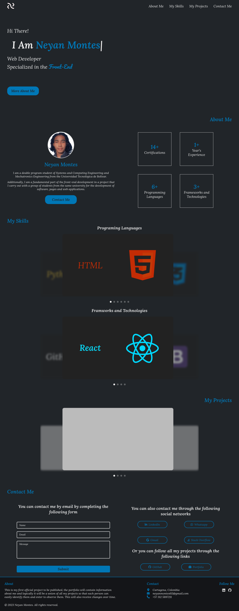

# Personal Portfolio

This is the first project officially for my advancement and specialization in frontend web development.

## Table of contents

- [Overview](#overview)
  - [The challenge](#the-challenge)
  - [Screenshot](#screenshot)
  - [Links](#links)
- [My process](#my-process)
  - [Built with](#built-with)
  - [What I learned](#what-i-learned)
  - [Continued development](#continued-development)
- [Author](#author)

## Overview

### The challenge

- Implement the UX/UI design to offer better quality to users
- Use the image carousel
- Add a responsive design to adapt to any screen and device

### Screenshot



### Links

- Live Site: [Personal Portfolio](https://xneymo.netlify.app/)

## My process

### Built with

- HTML 5
- CSS 3
- JavaScript

### What I learned

I learned how to build an image carousel using HTML, CSS, and JavaScript, and also understood how to optimize my CSS code by creating nested styles.

```html
<div class="languages-carrousel">
    <ul class="lancar-screens">
        <li id="lacasc1">
            <p class="shtml carrousel-subtitle">HTML</p>
        </li>

        <li id="lacasc2" class="left">
            <p class="scss carrousel-subtitle">CSS</p>
        </li>

        <li id="lacasc3" class="active">
            <p class="sjs carrousel-subtitle">JavaScript</p>
        </li>

        <li id="lacasc4" class="right">
            <p class="sjava carrousel-subtitle">Java</p>
        </li>

        <li id="lacasc5">
            <p class="scpp carrousel-subtitle">C++</p>
        </li>

        <li id="lacasc6">
            <p class="spython carrousel-subtitle">Python</p>
        </li>
    </ul>

    <div class="pagination"></div>
</div>
```
```css
.languages-carrousel {
    width: 900px;
    height: 400px;
    margin: auto;
    font-size: 0;
    overflow: hidden;
    font-size: 0;
    position: relative;
    text-align: left;
        
    .lancar-screens {
        list-style: none;
        padding: 0;
        margin: 0;
        width: 100%;
        height: 100%;
        width: 900px;
        height: 506px;
        position: relative;
        transform: translate(0%, -30%);
                
                
        & > li {
            width: 0%;
            height: 100%;
            width: 50%;
            height: 50%;
            display: inline-block;
            font-size: 15px;
            overflow: hidden;
            background: #bbb;
            border-radius: 10px;
            opacity: 0;
            filter: blur(5px);
            cursor: pointer;
            position: absolute;
            bottom: 0;
            transform: translate(50%, 0);
            transition: all .7s;
            pointer-events: none;
                    
            &:hover {
                filter: none;
                opacity: 1;
            }

            &.active {
                opacity: 1;
                filter: none;
                width: 70%;
                height: 70%;
                z-index: 100;
                transform: none;
                transform: translate(20%,0);
            }

            &.active, &.left, &.right {pointer-events: all;}
            &.left, &.right {transform: translate(0%, 0); opacity: .5;}
            &.left {transform: translate(0%, 0);}
            &.right {transform: translate(100%, 0);}
        
            .carrousel-subtitle {
                width: 50%;
                justify-content: center;
                align-items: center;
                text-align: center;
                display: flex;
                height: 100%;
                font-size: 3rem;
                pointer-events: none;
            }
        }
    }
            
    .pagination {
        list-style: none;
        padding: 5px;
        text-align: center;
        position: absolute;
        bottom: 0; left: 0; right: 0;

        & > li {
            display: inline-block;
            vertical-align: middle;
            width: 10px;
            height: 10px;
            margin: 5px;
            opacity: .3;
            cursor: pointer;
            background: #eee;
            border-radius: 100%;
            transition: all .2s;
            background-size: cover;
            background-position: center;
                    
            &:hover, &.active {opacity: 1;}
        }
    }
}
```
```js
$(function(){
    const init_carousel = function(carousel_class, screen_class) {
        let current_view = 0;
        const count_views = $(`${carousel_class} ${screen_class} li`).length;
        
        // Methodes
        const switch_view = function(id){
            if(id >= 0  &&  id <= count_views)
                current_view = id;
            update_view();
        };
    
        const init_pagination = function() {
            for(let i=0; i<count_views; i++) {
                let page = $('<li/>');
                $(page).click(function() {switch_view(i);});
                $(`${carousel_class} .pagination`).append(page);
            }
        };
    
        const update_view = function(){
            // Calculate the current state
            let view0 = current_view;
            let view1 = current_view+1;
            let view2 = current_view+2;
            if(view0 <= 0) view0 = count_views;
            if(view2 > count_views) view2 = 1;
            $(`${carousel_class} ${screen_class} li`).removeClass('left right');
            $(`${carousel_class} ${screen_class} li, ${carousel_class} .pagination li`).removeClass('active');
            $(`${carousel_class} ${screen_class} li:nth-child(${view1})`).addClass('active');
            $(`${carousel_class} ${screen_class} li:nth-child(${view0})`).addClass('left');
            $(`${carousel_class} ${screen_class} li:nth-child(${view2})`).addClass('right');
            $(`${carousel_class} .pagination li:nth-child(${view1})`).addClass('active');
        };
    
        $(`${carousel_class} ${screen_class} li`).click(function(e){
            let classes = $(e.target).attr('class');
            if(classes.includes('left')) {
                if(current_view==0)
                    current_view = count_views-1;
                else
                    current_view--;
            }
            else if(classes.includes('right')) {
                if(current_view == (count_views-1))
                    current_view = 0;
                else
                    current_view++;
            }
            update_view();
        });
        
        init_pagination();
        update_view();
    }

    init_carousel('.languages-carrousel', '.lancar-screens');
    init_carousel('.fratech-carrousel', '.fracar-screens');
    init_carousel('.project-carrousel', '.project-screens');
});
```

The information about the creation of the image carousels was obtained from a pen on CodePen, belonging to the user **aero15**. You can find more information about this [Pen](https://codepen.io/aero15/pen/QXqKYm).

### Continued development

The project, being my personal portfolio, will arise with constant design changes, be it the colors of the theme, the arrangement of the elements, and even the elements themselves, but above all, the responsive design, for which, as I do changes, I will add them to this section.

## Author

- Website - [XNeyMo Dev](https://xneymo.netlify.app/)
- Linkedin - [Neyan Manuel Montes Abad](https://www.linkedin.com/in/neyanmontes/)
- Gmail - [xneymodev@gmail.com](mailto:xneymodev@gmail.com)